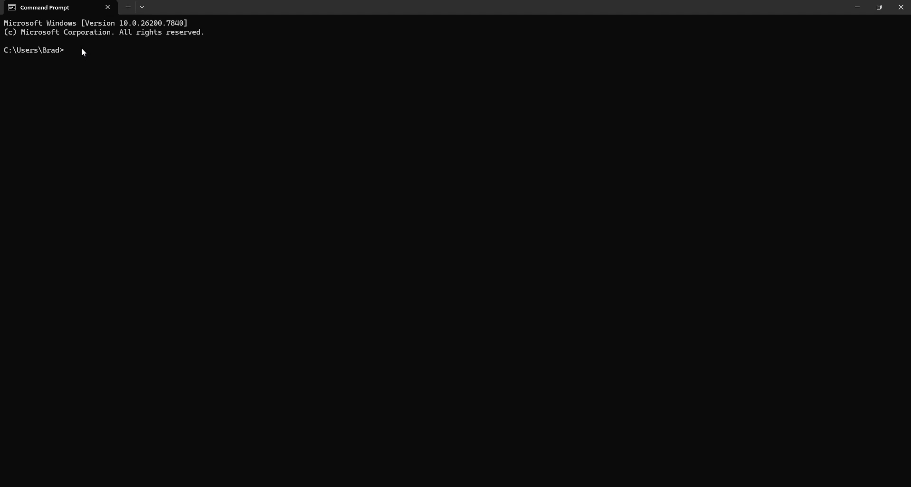

# ARCX

**Retrieve a file from a 10,000-file archive in 7 milliseconds.**

ARCX is a compressed archive format built for modern workflows. It lets CI/CD systems, build tools, and cloud storage retrieve one file without unpacking the whole archive.

Fast to create. Fast to query. No full decompression required.



*Demo: extracting one file from an 800 MB archive. TAR+ZSTD: 239 ms. ARCX: 13 ms.*

> **Full details:** [Benchmark methodology](benchmarks/) | [Format specification](FORMAT.md)

## Why ARCX?

Traditional archives force a choice: compress well (tar+zstd) or access fast (zip). ARCX does both.

- Cross-file compression matching tar+zstd ratios
- Indexed, block-level access to any file
- Single-digit millisecond retrieval
- Up to 200x less data read than tar+zstd

> ARCX reads kilobytes instead of megabytes.

### Why not ZIP?

- **ZIP** gives fast per-file access, but weak cross-file compression.
- **TAR+ZSTD** gives strong compression, but slow selective access.
- **ARCX** is designed to deliver both.

## Quick Start

```bash
# Install
cargo install arcx

# Get a single file (instant)
time arcx get output.arcx src/main.rs

# Pack a directory
arcx pack ./my-project output.arcx

# List contents
arcx list output.arcx

# Extract everything
arcx extract output.arcx ./output-dir

# Show archive info
arcx info output.arcx

# Detailed timing breakdown
arcx get output.arcx src/main.rs --time
```

## Data Movement (The Real Bottleneck)

How much data does the format actually read from disk to extract ONE file?

ARCX reduces unnecessary data transfer by up to **200x**.

| Dataset | Target File | ARCX | TAR+ZSTD | ZIP |
|---------|------------|-----:|---------:|----:|
| Build artifacts (581 files, 181 MB) | 36.4 KB .o file | **713.8 KB** | 140.4 MB | 36.5 KB |
| Python ML project (206 files, 64 MB) | 6.9 KB .py file | **326.1 KB** | 63.1 MB | 2.1 KB |
| Log archive (1,008 files, 30 MB) | 35.8 KB log file | **365.8 KB** | 5.0 MB | 6.1 KB |
| Node.js project (19,001 files, 43 MB) | 1.5 KB .d.ts file | **1.3 MB** | 17.4 MB | 632 B |
| Source code repo (389 files, 1.9 MB) | 4.5 KB .go file | **373.8 KB** | 656.1 KB | 1.9 KB |

ARCX reads the manifest plus one compressed block. TAR+ZSTD reads the entire archive. ZIP reads only the individual file entry (no cross-file compression to navigate).

## Selective Access Performance

The defining metric. How long to extract ONE file from a sealed archive?

```
Build Artifacts (581 files, 181 MB)
  ARCX      |##                                            |   7.9 ms
  ZIP       |#                                             |   1.7 ms
  TAR+ZSTD  |#########################                     | 147.7 ms
  TAR+GZ    |################################################ 409.3 ms

Log Archive (1,008 files, 30 MB)
  ARCX      |#                                             |   7.3 ms
  ZIP       |#                                             |   3.0 ms
  TAR+ZSTD  |############                                  |  99.5 ms
  TAR+GZ    |################################################ 238.4 ms

Python ML Project (206 files, 64 MB)
  ARCX      |#                                             |   2.8 ms
  ZIP       |#                                             |   0.9 ms
  TAR+ZSTD  |###############                               |  53.4 ms
  TAR+GZ    |################################################ 180.0 ms

Node.js Project (19,001 files, 43 MB)
  ARCX      |#####                                         | 131.3 ms
  ZIP       |##                                            |  62.5 ms
  TAR+ZSTD  |################################              | 840.9 ms
  TAR+GZ    |################################################  1.26 s
```

ZIP also supports random access via its central directory -- that is why it appears fast in these charts. The comparison is most meaningful against TAR-based formats, which represent the majority of compressed archives in CI/CD and cloud storage. ARCX combines the compression advantage of TAR+ZSTD with direct file access.

> ARCX makes archive access effectively direct and block-addressable.

All measurements are cold-cache medians (3 runs each) on Windows 11, Intel i7 (22 cores). Datasets are synthetic but representative of real-world workloads. See [benchmarks/](benchmarks/) for full methodology and raw data.

## Compression

ARCX matches TAR+ZSTD compression ratios across all workloads. Both outperform ZIP due to cross-file compression.

| Dataset | Files | Input | ARCX | TAR+ZSTD | ZIP |
|---------|------:|------:|-----:|---------:|----:|
| Node.js project | 19,001 | 42.6 MB | 18.8 MB (44.0%) | 17.4 MB (40.8%) | 21.7 MB (50.9%) |
| Python ML project | 206 | 63.8 MB | 63.1 MB (98.9%) | 63.1 MB (98.9%) | 63.1 MB (98.9%) |
| Build artifacts | 581 | 180.9 MB | 140.5 MB (77.6%) | 140.4 MB (77.6%) | 140.5 MB (77.7%) |
| Log archive | 1,008 | 30.4 MB | 5.0 MB (16.5%) | 5.0 MB (16.6%) | 5.1 MB (16.8%) |
| Source code repo | 389 | 1.9 MB | 683.5 KB (34.3%) | 656.1 KB (33.0%) | 721.8 KB (36.3%) |

## How It Works

### Block-Based Architecture

ARCX groups files into compressed blocks. Multiple small files share a single block. Large files span multiple blocks. Each block is independently decompressible.

```
+----------+-------+-------+-------+-----+----------+--------+
|  Header  | Block | Block | Block | ... | Manifest | Footer |
| (80 B)   |   0   |   1   |   2   |     |          | (40 B) |
+----------+-------+-------+-------+-----+----------+--------+
```

### Manifest Index

The manifest is a binary index stored at the end of the archive. It maps every file path to the block(s) containing its data, along with offsets and sizes. The manifest itself is zstd-compressed and uses delta encoding and a string table to minimize overhead.

On a `get` operation, ARCX:
1. Reads the 40-byte footer to locate the manifest
2. Reads and decompresses the manifest
3. Looks up the target file's block reference(s)
4. Seeks to and decompresses only the relevant block(s)
5. Extracts the file data from the decompressed block

Total I/O: footer + manifest + one block. Everything else is untouched.

### Cross-File Compression

Because multiple files are packed into the same block before compression, zstd sees cross-file redundancy. This is why ARCX matches TAR+ZSTD compression ratios -- both compress files together -- while ZIP compresses each file independently.

## Use Cases

- **CI/CD artifacts** -- Store build outputs once, retrieve individual files on demand without downloading and decompressing the full archive.
- **Cloud storage** -- Reduce egress costs by reading only the bytes you need. Combine with HTTP range requests for remote selective extraction.
- **Package managers** -- Inspect package metadata or extract a single file without pulling the entire package.
- **Game assets** -- Load individual textures, models, or audio files from a compressed asset bundle at runtime.
- **Log archives** -- Query a specific day's logs from a compressed monthly archive without decompressing the other 29 days.

## Prior Work

Block-based compression and indexed access exist in specialized systems (e.g., BGZF in bioinformatics, WARC for web archives). ARCX brings these ideas into a general-purpose archive format designed for modern developer workflows.

## Current Limitations

- Remote/S3 range-request reads not yet implemented (planned).
- Manifest index overhead is still being optimized for archives with 100K+ files.
- Current benchmarks focus on selective access; full extraction performance parity with tar+zstd is expected in the Rust implementation but not yet benchmarked at scale.

## Format Specification

See [FORMAT.md](FORMAT.md) for the complete binary format specification.

```
Header (80 bytes)
  Magic, version, offsets to manifest and data, flags, timestamp

Blocks (variable)
  4-byte LE size prefix + zstd-compressed payload
  Each block contains one or more file chunks

Manifest (variable)
  Binary index: string table, file entries, chunk entries, block entries
  Delta-encoded offsets, varint sizes, zstd-compressed

Footer (40 bytes)
  Magic, manifest offset/size, total file count, checksum
```

## Building from Source

```bash
git clone https://github.com/getarcx/arcx.git
cd arcx
cargo build --release
```

The binary will be at `target/release/arcx` (or `arcx.exe` on Windows).

## License

Licensed under the Apache License, Version 2.0. See [LICENSE](LICENSE) for details.

---

Built by [Highpass Studio](https://highpass.studio)
